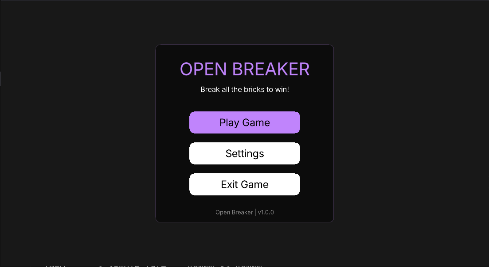
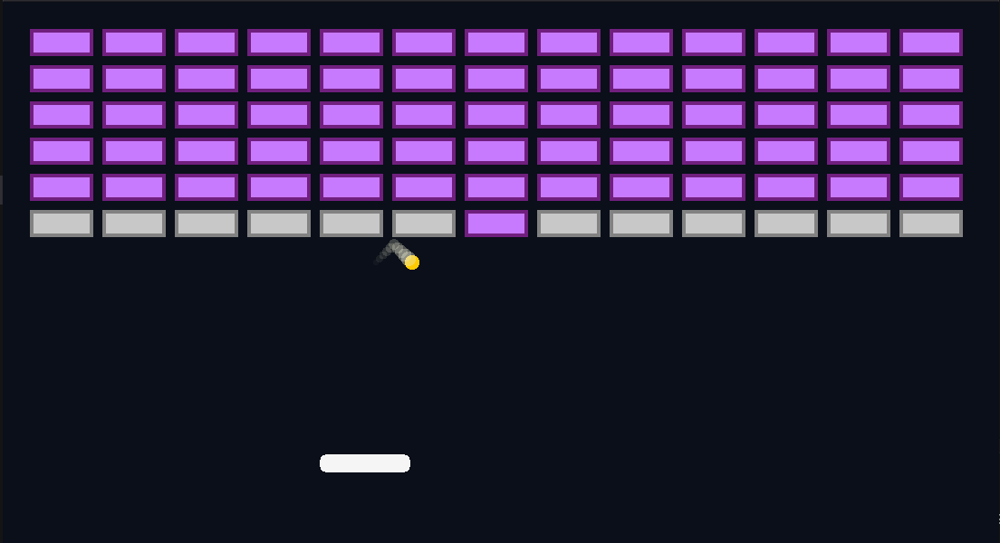
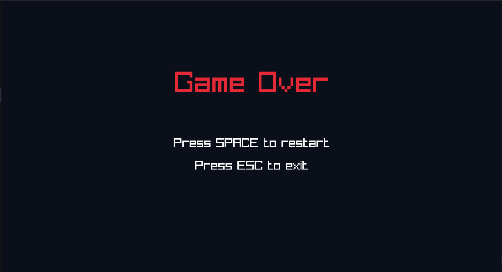

# 🧱 open_breaker

**open_breaker** is a fast-paced, level-based brick breaker game built using [Raylib](https://www.raylib.com/) and [raylib-go](https://github.com/gen2brain/raylib-go). Enjoy classic gameplay with modern effects, particles, sound, and progressive difficulty.

---

## 🖥️ Download

| Platform | Download Link |
|----------|----------------|
| 🪟 Windows | [Download open_breaker.exe](https://example.com/open_breaker_windows.zip) |
| 🐧 Linux   | [Download open_breaker (x86_64)](https://example.com/open_breaker_linux.tar.gz) |

> ⚠️ Make sure you have OpenGL-compatible graphics and necessary permissions to run the binaries.

---

## 🍎 macOS Build Instructions

> macOS builds are not provided due to code signing and notarization requirements, but you can build it yourself:

### 1. Install dependencies

```bash
brew install go
````

### 2. Clone and build

```bash
git clone https://github.com/yourusername/open_breaker.git
cd open_breaker
go mod tidy
go build -o open_breaker main.go
```

### 3. Run

```bash
./open_breaker
```

---

## 📸 Screenshots

### Menu Screen



### Gameplay - Level 1



### Game Over Screen



---

## 🎮 Features

* 🎨 Smooth 2D graphics powered by raylib
* 🔊 Dynamic bounce and break sounds
* 💥 Particle effects on brick destruction
* 🔐 Level progression
* 🎮 Responsive controls with paddle-ball dynamics
* 🧱 Unbreakable & special bricks for added strategy

---

## 🔧 Development

This game is written in **Go** using the [raylib-go](https://github.com/gen2brain/raylib-go) bindings.

### File Structure Highlights:

* `screens/` - Contains UI and gameplay screen logic
* `entity/` - Game entities like Player, Ball, Bricks
* `effects/` - Particle and visual effects
* `utility/` - Helper functions and asset management

---

## 🙌 Credits

* [raylib-go](https://github.com/gen2brain/raylib-go)
* Sound assets from [Pixabay](https://pixabay.com/)
* Font & UI inspiration from retro-style arcade games

---

## 📝 License

MIT License. See `LICENSE` file for details.

---

Happy Breaking! 💥